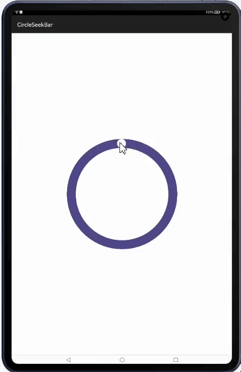
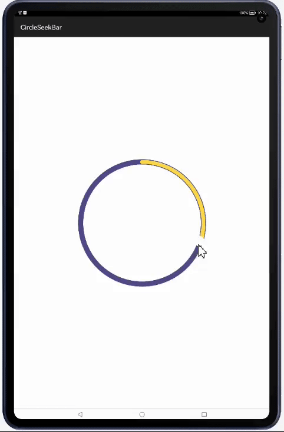

[](https://github.com/applibgroup/CircleSeekbar/actions/workflows/main.yml)
[](https://sonarcloud.io/summary/new_code?id=applibgroup_CircleSeekbar)
# CircleSeekBar

A HMOS circle seekbar library

## Source
Inspired by [feeeei/CircleSeekbar](https://github.com/feeeei/CircleSeekbar) - version v1.1.2

## Feature
This library which provides circle seekbar feature.

- Download Ability


- SetProcess Ability


- Style1 Ability



- Style2 Ability



- Union Ability


- WithShadow Ability


- WithText Ability


## Dependency
1 . For using CircleSeekBar lib module in sample app, include the source code and add the below dependencies in entry/build.gradle to generate hap/support.har.
```groovy
	dependencies {
		implementation project(':lib')
        implementation fileTree(dir: 'libs', include: ['*.har'])
        testImplementation 'junit:junit:4.13'
	}
```
2 . For using CircleSeekBar lib in separate application using har file, add the har file in the entry/libs folder and add the dependencies in entry/build.gradle file.
```groovy
	dependencies {
		implementation fileTree(dir: 'libs', include: ['*.har'])
		testImplementation 'junit:junit:4.13'
	}
```
3 . For using CircleSeekBar lib from a remote repository in separate application, add the below dependencies in entry/build.gradle file.
```groovy
    dependencies {
        implementation 'dev.applibgroup:circleseekbar:1.0.0'
        testCompile 'junit:junit:4.13'
    }
```

## Usage

### Attributes Description

Attribute | Description
--- | ---
`wheel_reached_width` | reached width of ` CircleSeekBar ` wheel
`wheel_reached_color` | reached color of `CircleSeekBar` wheel
`wheel_unreached_width` | unreached width of ` CircleSeekBar ` wheel
`wheel_unreached_color` | unreached color of `CircleSeekBar` wheel
`wheel_max_process` | maximum process value for `CircleSeekBar` wheel
`wheel_cur_process` | current process value for `CircleSeekBar` wheel
`wheel_pointer_radius` | radius value of pointer for `CircleSeekBar` wheel
`wheel_pointer_color` | pointer color for the ` CircleSeekBar ` wheel
`wheel_can_touch` | if you want to block touchListener,use like processBar, only allow the code to control the schedule, you can change this attribute to false 
`wheel_scroll_only_one_circle` | scroll across the circle only once smoothly
`wheel_has_pointer_shadow` | to enable and disable the pointer shadow of ` CircleSeekBar ` wheel
`wheel_has_wheel_shadow` | to enable and disable the wheel shadow of ` CircleSeekBar ` wheel
`wheel_pointer_shadow_radius` | radius value for pointer shadow of ` CircleSeekBar ` wheel
`wheel_shadow_radius` | radius value for wheel shadow of ` CircleSeekBar ` wheel

### Added to the XML

```xml
<io.feeeei.circleseekbar.CircleSeekBar
        ohos:id="$+id:progress"
        ohos:width="350vp"
        ohos:height="350vp"
        ohos:center_in_parent="true"
        ohos:padding="4vp"
        app:wheel_reached_width="30vp"
        app:wheel_unreached_width="34vp"
        app:wheel_cur_process="10"
        app:wheel_max_process="100"
        app:wheel_pointer_radius="12vp"
        app:wheel_can_touch="true"
        app:wheel_scroll_only_one_circle="true"
        app:wheel_pointer_color="#FFFAF5F5"
        app:wheel_reached_color="$color:colorAccent"
        app:wheel_unreached_color="$color:colorPrimary"
        app:wheel_has_pointer_shadow="true"
        app:wheel_has_wheel_shadow="true"
        app:wheel_pointer_shadow_radius="3vp"
        app:wheel_shadow_radius="3vp"
    />
```

### Other supported methods
```java
CircleSeekBar circleSeekBar = new CircleSeekBar(this);
circleSeekBar.setCurProcess(10);
circleSeekBar.setMaxProcess(100);
circleSeekBar.setReachedWidth(30);
circleSeekBar.setUnreachedWidth(34);
circleSeekBar.setPointerRadius(12);
circleSeekBar.setReachedColor(Color.getIntColor("#FF4081"));
circleSeekBar.setUnreachedColor(Color.getIntColor("#3F51B5"));
circleSeekBar.setPointerColor(Color.getIntColor("#FFFAF5F5"));
circleSeekBar.setPointerShadowRadius(3);
circleSeekBar.setWheelShadow(3);
circleSeekBar.setHasReachedCornerRound(true);
```
